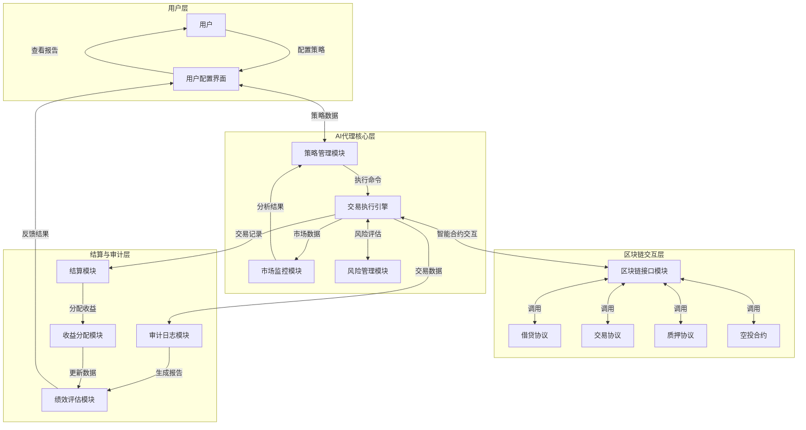

# ZippiFi AI代理功能文档

## 1. AI代理的概念

ZippiFi AI代理是一种智能自动化工具，旨在帮助用户在区块链金融领域实现资产的智能化管理和增值。它通过预设的策略和实时市场数据分析，自动执行各类DeFi操作，使用户无需持续监控市场和手动操作，即可获得自动化的资产管理服务。

Talus Network
官网：https://www.talus.network/
核心概念：
Talus Network是一个融合AI与区块链的去中心化平台，旨在构建“智能代理中心”（AI Agent Hub），通过高吞吐量L1区块链（基于Move语言）和跨链协议（IBC）实现智能代理的自主交互与资源调度。
关键组件：
   Talus Tool：链上服务工具，分为Onchain（完全智能合约执行）和Offchain（链上身份+外部服务）两类，支持零知识证明验证，确保计算过程可验证。
   Mirror Objects：桥接链下资源（如AI模型、数据）与链上环境，实现资源唯一性与可交易性。
   Protochain Node：基于Cosmos SDK和CometBFT的PoS区块链节点，保障系统安全性与可扩展性。
   
应用场景
支持AI代理的自主决策、跨链资产操作及链下数据集成，解决中心化AI系统的数据隐私与安全性问题，推动去中心化AI生态发展。

### 1.1 核心价值
- **智能化决策**：基于AI算法和用户设定的风险偏好，自动做出最优交易决策
- **自动化执行**：24/7全天候监控市场，及时执行交易和资金调配
- **多元化策略**：支持多种DeFi操作，包括借贷、交易、质押和空投等
- **风险管理**：内置风险控制机制，根据市场波动自动调整投资组合
- **收益优化**：通过实时数据分析和策略调整，最大化用户资产收益

### 1.2 应用场景
- 长期投资者：通过自动化管理实现资产的长期稳健增值
- 流动性提供者：优化流动性提供策略，最大化手续费收益
- 套利交易者：捕捉跨市场、跨链的套利机会
- 被动收入寻求者：通过AI代理自动参与各类收益活动

## 2. 功能模块设计

### 2.1 整体架构



### 2.2 用户配置阶段

#### 2.2.1 策略设置模块
- **策略参数配置**：用户设定风险偏好、资产配置比例、交易阈值、目标收益率等核心参数
- **智能策略模板**：提供多种预设策略模板（保守型、平衡型、激进型）供用户选择和修改
- **自定义规则引擎**：支持用户通过可视化界面或脚本语言编写特定交易规则和条件
- **策略回测功能**：允许用户使用历史数据测试策略表现，评估预期收益和风险

#### 2.2.2 收益分配规则设置
- **多级分成机制**：支持设置用户、AI平台、推荐人等多方收益分成比例
- **动态激励调整**：根据代理表现自动调整收益分配比例，激励长期稳定表现
- **阶梯式收益结构**：设置不同收益区间对应的分成比例，超额收益部分提高平台分成
- **特殊情况处理规则**：定义极端市场条件下的收益分配特殊规则

#### 2.2.3 代币质押功能（可选）
- **质押金额管理**：用户可设置质押代币种类、数量及锁定期限
- **质押奖励机制**：提供质押挖矿奖励，降低平台使用费等激励措施
- **风险缓冲池**：质押代币可作为风险缓冲，在特定条件下用于弥补损失
- **解除质押流程**：定义质押解除条件、冷却期和惩罚机制

### 2.3 AI代理执行阶段

#### 2.3.1 市场监控与分析
- **多链数据聚合**：实时收集和分析各区块链网络的市场数据
- **智能行情分析**：使用机器学习模型预测市场走势和资产价格
- **风险预警系统**：监控市场异常波动，触发风险控制机制
- **套利机会识别**：自动发现跨交易所、跨链套利机会

#### 2.3.2 交易执行引擎
- **智能合约交互**：与DeFi协议智能合约进行安全交互
- **最优路径算法**：选择最优交易路径，最小化滑点和交易成本
- **批量交易处理**：高效处理多笔交易，优化交易时机和顺序
- **失败重试机制**：处理交易失败情况，自动尝试替代方案

#### 2.3.3 多元化策略执行
- **借贷管理**：根据利率波动自动调整借贷头寸，优化资金成本
- **流动性提供**：在DEX中提供流动性并管理头寸，获取手续费收益
- **质押管理**：自动选择最优质押协议和时间，最大化质押收益
- **空投机会捕捉**：监控和自动参与潜在空投活动

#### 2.3.4 风险管理系统
- **投资组合风险评估**：实时计算和监控投资组合的风险指标
- **仓位限额控制**：根据预设风险偏好自动调整单个资产最大仓位
- **止损策略执行**：设置和执行自动止损机制，限制潜在损失
- **流动性风险管理**：监控和管理投资组合的整体流动性状况

### 2.4 结算与审计阶段

#### 2.4.1 微支付结算系统
- **实时结算引擎**：按设定周期（小时/天/周）自动执行微支付结算
- **多链支付聚合**：支持跨链支付结算，简化多链资产管理
- **Gas优化**：智能选择结算时机，优化Gas费用支出
- **支付失败处理**：自动重试失败的支付，记录和通知异常情况

#### 2.4.2 收益分配执行
- **多方分账处理**：根据预设规则自动计算并分配各方应得收益
- **税费计算与扣除**：集成税费计算逻辑，自动预扣相关税费
- **分配记录生成**：为每笔分配生成详细记录，支持后续查询和审计
- **异常情况处理**：处理收益不足等异常情况的分配规则

#### 2.4.3 交易审计系统
- **全流程交易记录**：记录AI代理执行的每一笔交易详情
- **不可篡改存储**：关键交易数据存储在区块链上，确保数据不可篡改
- **交易可视化界面**：提供直观的交易历史查询和统计分析功能
- **合规报告生成**：自动生成符合监管要求的交易报告

#### 2.4.4 绩效评估与报告
- **多维绩效指标**：计算收益率、夏普比率、最大回撤等绩效指标
- **定期报告自动生成**：按周期自动生成绩效报告并推送给用户
- **策略优化建议**：基于历史表现，提供策略参数优化建议
- **基准对比分析**：将AI代理表现与市场基准指数进行对比分析

## 3. 系统流程图

AI代理系统工作流程分为三个核心阶段，形成一个完整的闭环：


### 3.1 流程图说明

1. **用户配置阶段**（蓝色区域）
   - 用户首先设置策略参数、收益分配规则，并可选择质押代币
   - 配置完成后，AI代理获得执行授权和操作指南

2. **AI代理执行阶段**（绿色区域）
   - 市场监控模块实时收集和分析市场数据
   - 交易执行引擎根据策略和市场情况执行各类DeFi操作
   - 多元化策略执行模块管理借贷、流动性提供、质押等具体操作
   - 风险管理系统全程监控交易风险，确保操作安全

3. **结算与审计阶段**（橙色和红色区域）
   - 微支付结算系统执行定期结算
   - 收益分配模块按照预设规则分配各方收益
   - 交易审计系统记录所有操作，确保透明度和可追溯性
   - 绩效评估模块生成绩效报告，为用户提供决策参考

4. **反馈循环**
   - 审计和评估结果反馈给用户，帮助优化策略配置
   - 用户可以根据绩效报告调整策略参数，形成持续优化的闭环

## 4. 页面操作原型图

### 4.1 AI代理配置页面

```
+----------------------------------------------------+
|                    ZippiFi AI代理                   |
+----------------------------------------------------+
| 策略设置   收益分配   质押管理   绩效报告   帮助中心 |
+----------------------------------------------------+
|                                                    |
|  [策略模板选择]                                    |
|  保守型  |  平衡型  |  激进型  |  自定义       |
|                                                    |
|  风险偏好: [低] [中] [高]                          |
|                                                    |
|  资产配置:                                         |
|  BTC: [30%] [调整滑块]                             |
|  ETH: [40%] [调整滑块]                             |
|  stablecoins: [20%] [调整滑块]                     |
|  altcoins: [10%] [调整滑块]                        |
|                                                    |
|  交易参数:                                         |
|  最大单笔交易金额: [10,000 USD]                    |
|  止损比例: [10%]                                   |
|  目标收益率: [20%/年]                              |
|                                                    |
|  [策略回测]  [保存策略]  [启动代理]                |
|                                                    |
+----------------------------------------------------+
```

### 4.2 收益分配设置页面

```
+----------------------------------------------------+
|                    收益分配设置                      |
+----------------------------------------------------+
|                                                    |
|  基础分配比例:                                     |
|  用户: [85%] [调整滑块]                            |
|  AI平台: [15%] [调整滑块]                          |
|                                                    |
|  超额收益分配:                                     |
|  当收益率 > 20%/年: 用户[80%], 平台[20%]           |
|  当收益率 > 50%/年: 用户[75%], 平台[25%]           |
|                                                    |
|  推荐奖励: [5%] (来自平台分成部分)                  |
|                                                    |
|  结算周期: [每日] [每周] [每月]                     |
|                                                    |
|  [保存设置]                                        |
|                                                    |
+----------------------------------------------------+
```

### 4.3 AI代理监控仪表盘

```
+----------------------------------------------------+
|                    AI代理仪表盘                     |
+----------------------------------------------------+
|                                                    |
|  当前状态: [运行中] [暂停]                          |
|                                                    |
|  总资产管理: [50,000 USD]                          |
|  累计收益: [+5,250 USD] (+10.5%)                   |
|  今日收益: [+120 USD] (+0.24%)                     |
|                                                    |
|  资产分布饼图                                       |
|                                                    |
|  最近交易:                                         |
|  • 买入ETH: 0.5 ETH @ $3,200                       |
|  • 提供流动性: ETH-USDC 池                        |
|  • 质押AVAX: 10 AVAX @ 8% APY                      |
|                                                    |
|  风险指标:                                         |
|  夏普比率: [1.8]                                  |
|  最大回撤: [5%]                                   |
|                                                    |
|  [查看详情] [调整策略] [暂停代理] [提取收益]        |
|                                                    |
+----------------------------------------------------+
```

### 4.4 交易历史与审计页面

```
+----------------------------------------------------+
|                   交易历史与审计                    |
+----------------------------------------------------+
|                                                    |
|  过滤: [时间范围] [交易类型] [资产类型]             |
|                                                    |
|  交易记录表格:                                     |
|  +--------+----------+--------+---------+--------+ |
|  | 时间   | 类型     | 资产   | 数量    | 状态   | |
|  +--------+----------+--------+---------+--------+ |
|  | 14:30  | 买入     | ETH    | 0.5     | 成功   | |
|  | 13:15  | 提供流动性| ETH-USDC| 0.5/1600| 成功   | |
|  | 10:05  | 质押     | AVAX   | 10      | 成功   | |
|  | 09:20  | 结算     | USDC   | +120    | 成功   | |
|  +--------+----------+--------+---------+--------+ |
|                                                    |
|  [导出CSV] [生成报告] [区块链验证]                  |
|                                                    |
+----------------------------------------------------+
```

## 5. 操作步骤

### 5.1 AI代理初始设置流程

1. **访问AI代理模块**
   - 登录ZippiFi平台，从主菜单进入"AI代理"功能页面

2. **选择策略模板**
   - 根据个人风险偏好，选择保守型、平衡型或激进型策略模板
   - 或选择"自定义"创建个性化策略

3. **配置基础参数**
   - 设置风险偏好等级（低/中/高）
   - 调整各类资产的配置比例
   - 设置交易参数（单笔交易限额、止损比例、目标收益率等）

4. **回测策略**
   - 点击"策略回测"按钮
   - 查看历史表现数据和关键绩效指标
   - 根据回测结果调整策略参数

5. **设置收益分配规则**
   - 进入"收益分配"标签页
   - 设置用户与平台的基础分成比例
   - 配置超额收益分配规则
   - 选择结算周期（每日/每周/每月）

6. **选择性质押代币**
   - 进入"质押管理"标签页
   - 选择质押代币类型和数量
   - 设置质押期限和相关条件

7. **启动AI代理**
   - 确认所有设置无误后，点击"启动代理"按钮
   - 授权AI代理访问相应资产
   - 设置交易密码进行二次确认

### 5.2 AI代理监控与管理流程

1. **查看仪表盘**
   - 进入AI代理仪表盘页面
   - 查看实时运行状态、资产管理规模和收益情况
   - 监控资产分布和最近交易

2. **调整策略**
   - 点击"调整策略"按钮
   - 修改策略参数（无需停止代理）
   - 保存新设置，AI代理将自动应用新策略

3. **暂停/重启代理**
   - 在仪表盘点击"暂停代理"按钮暂时停止操作
   - 需要时点击"重启代理"恢复运行

4. **提取收益**
   - 点击"提取收益"按钮
   - 选择提取金额和接收地址
   - 确认交易完成提取

### 5.3 审计与绩效评估流程

1. **查看交易历史**
   - 进入"交易历史与审计"页面
   - 使用过滤条件查询特定交易
   - 查看每笔交易的详细信息和区块链记录

2. **生成绩效报告**
   - 在"绩效报告"标签页选择报告周期
   - 点击"生成报告"按钮
   - 查看包含收益分析、风险评估和策略建议的完整报告

3. **导出数据**
   - 在交易历史页面点击"导出CSV"
   - 下载交易记录用于本地分析或税务申报

4. **区块链验证**
   - 点击"区块链验证"按钮
   - 查看关键交易在区块链上的确认状态和详细信息
   - 验证交易的真实性和不可篡改性

## 6. 安全与风险管理

### 6.1 安全保障措施
- **多重签名机制**：关键操作需要多重授权
- **限额控制**：设置最大交易限额，降低潜在风险
- **冷热钱包分离**：主要资产存储在冷钱包中
- **定期安全审计**：由第三方安全机构进行定期审计
- **异常检测系统**：实时监控异常交易行为

### 6.2 风险管理策略
- **分散投资**：资产在不同协议和链上分散配置
- **动态止损**：根据市场情况自动调整止损点
- **流动性管理**：确保投资组合保持足够流动性
- **压力测试**：定期进行极端市场条件下的压力测试
- **保险机制**：与DeFi保险协议合作，为用户资产提供额外保障

---
