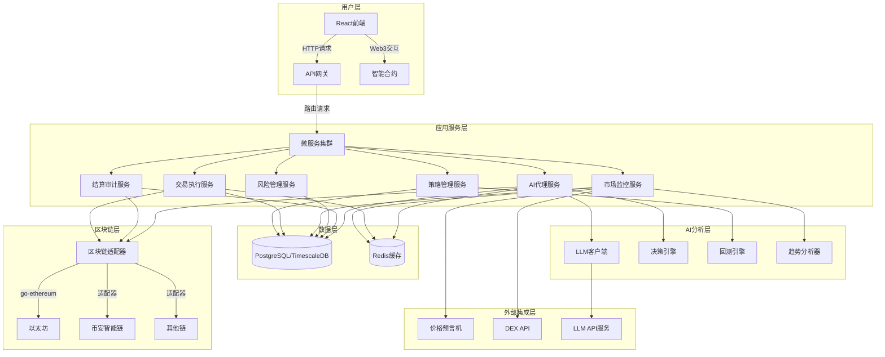

# ZippiFi Go后端技术架构设计

## 1. 技术栈选择

### 1.1 后端服务
- **编程语言**: Go 1.20+
  - 优势：高性能，原生并发支持，编译为单一二进制，内存效率高，适合高并发后端服务
- **Web框架**: Gin/Echo/Fiber
  - 优势：高性能HTTP路由器，中间件丰富，易于扩展，API设计简洁
- **任务调度**: Go worker pool + Redis
  - 优势：轻量级任务队列，基于goroutine的并发处理，性能优异
- **ORM**: GORM
  - 优势：Go语言最流行的ORM库，支持自动迁移，关系映射强大

### 1.2 数据存储
- **关系型数据库**: PostgreSQL
  - 用途：存储用户数据、策略配置、交易记录、审计日志等结构化数据
- **时序数据库**: TimescaleDB (PostgreSQL扩展)
  - 用途：存储市场数据、价格历史、性能指标等时间序列数据
- **缓存**: Redis
  - 用途：缓存热点数据、会话管理、任务队列、分布式锁
- **对象存储**: MinIO/S3
  - 用途：存储回测结果、绩效报告、大量历史数据等

### 1.3 AI与机器学习
- **核心库**: GoML, GoNum
  - 用途：实现统计模型、数据预处理和基础分析
  - 应用场景 ：风险评估、数据统计、简单分类和预测任务
- **外部集成**: gRPC与Python ML服务集成
  - 用途：复杂机器学习模型部署，价格预测模型
- **时间序列分析**: Go语言实现的时间序列库
  - 用途：市场趋势分析，实时指标计算
- **优化算法**: 自研Go优化库或与CPLEX/Gurobi集成
  - 用途 ：投资组合优化、交易路径优化
  - 应用场景 ：资产配置优化、交易成本最小化、风险调整收益最大化
  
### 1.4 区块链交互
- **Web3库**: go-ethereum
  - 用途：与以太坊及兼容链交互，合约调用
- **多链支持**: 自定义适配器模式 + go-ethereum扩展
  - 用途：跨链操作和数据传递
- **智能合约开发**: Solidity, Hardhat
  - 用途：代理合约、权限管理、交易执行
- **节点服务**: Infura, Alchemy
  - 用途：区块链节点接入服务

### 1.5 前端技术
- **框架**: React + TypeScript
  - 优势：组件化开发，类型安全，生态丰富
- **状态管理**: Redux Toolkit
  - 优势：可预测的状态管理，开发工具完善
- **UI组件库**: Ant Design
  - 优势：专业金融UI组件，可定制性强
- **可视化**: ECharts, D3.js
  - 优势：高性能图表，支持复杂数据可视化
- **区块链交互**: ethers.js, wagmi
  - 优势：现代Web3前端库，支持多钱包

### 1.6 基础设施
- **容器化**: Docker + Kubernetes
  - 用途：服务容器化，弹性伸缩，负载均衡
- **监控**: Prometheus + Grafana
  - 用途：系统监控，性能指标，告警
- **日志**: ELK Stack (Elasticsearch, Logstash, Kibana)
  - 用途：日志收集，分析，可视化
- **CI/CD**: GitHub Actions/Jenkins
  - 用途：自动化测试，部署
- **API网关**: Kong/Traefik
  - 用途：API管理，认证，限流

## 2. 系统架构设计

### 2.1 整体架构图

### 2.2 模块职责划分

#### 2.2.1 策略管理服务
- 策略模板管理（CRUD）
- 自定义策略配置
- 策略回测引擎（Go实现）
- 策略性能分析

#### 2.2.2 交易执行服务
- 智能订单路由（基于goroutine并发）
- 交易路径优化（图算法实现）
- 批量交易处理（高效并发处理）
- 交易失败重试机制（指数退避算法）

#### 2.2.3 市场监控服务
- 多链数据聚合（并发爬虫）
- 实时行情分析（流式处理）
- 异常波动检测（滑动窗口算法）
- 套利机会识别（并发计算）

#### 2.2.4 风险管理服务
- 投资组合风险评估
- 仓位限额控制
- 自动止损策略
- 流动性风险管理

#### 2.2.5 结算审计服务
- 实时结算引擎
- 多方收益分配
- 交易审计日志
- 绩效报告生成

#### 2.2.6 AI代理服务
- 用户交互管理（对话系统）
- 智能决策引擎（基于LLM）
- 工具调用执行
- 代理行为监控

#### 2.2.7 区块链适配器
- 多链协议标准化接口
- 智能合约交互封装（go-ethereum）
- Gas优化策略（动态调整）
- 交易状态监控（并发监听）

### 2.3 数据流设计

#### 2.3.1 核心数据流
1. **配置数据流**
   - 用户通过前端配置策略参数
   - 策略配置存储到PostgreSQL
   - 策略服务加载配置并初始化AI代理

2. **市场数据流**
   - 市场服务通过goroutine并发从预言机和DEX API获取实时数据
   - 数据存入TimescaleDB和Redis缓存
   - AI引擎分析数据生成交易信号

3. **交易执行流**
   - 策略服务根据信号生成交易指令
   - 执行服务使用Go协程优化交易路径并发送到区块链适配器
   - 适配器与区块链交互执行交易
   - 交易结果返回并更新状态

4. **结算审计流**
   - 结算服务定期计算收益
   - 根据规则分配收益并执行转账
   - 审计服务记录所有交易和分配记录
   - 生成绩效报告并推送给用户

## 3. 关键技术实现

### 3.1 分布式架构实现
- 采用微服务架构，各模块独立部署和扩展
- 使用gRPC进行服务间通信，HTTP/REST面向外部接口
- 基于context包实现请求上下文传递和超时控制
- 使用sync.WaitGroup和atomic包确保并发安全

### 3.2 Go并发模型实现
- **goroutine池**: 实现可复用的goroutine池，避免频繁创建销毁
- **channel通信**: 使用channel进行goroutine间安全通信
- **context管理**: 基于context进行请求生命周期管理和取消操作
- **互斥锁**: 关键数据结构使用sync.Mutex和sync.RWMutex保护

### 3.3 AI集成实现
- **LLM客户端**: Go实现的LLM API客户端，支持函数调用
- **决策引擎**: 基于goroutine的并发决策系统
- **向量存储**: 集成Milvus/Qdrant向量数据库，支持语义检索
- **模型缓存**: 基于Redis的模型结果缓存系统

### 3.4 区块链交互优化
- **并发交易**: 使用goroutine并发处理多笔交易
- **Gas优化**: 实时监控网络状况，动态调整Gas价格
- **交易重试**: 智能重试机制，避免交易失败
- **批量签名**: 高效的交易批量签名算法

### 3.5 安全机制实现
- **多重签名**: 关键操作需要多节点授权
- **限额控制**: 智能合约层面实现交易限额
- **输入验证**: 严格的输入参数验证和类型检查
- **错误处理**: 统一的错误处理机制和日志记录

### 3.6 性能优化
- **内存管理**: 精确控制内存分配，避免频繁GC
- **连接池**: 数据库连接池和HTTP客户端连接池优化
- **缓存策略**: 多级缓存策略，减少重复计算
- **算法优化**: 关键路径使用高性能算法实现

## 4. Go技术栈优势

### 4.1 性能优势
- 编译型语言，执行效率高，启动速度快
- 原生并发支持，goroutine轻量级线程
- 内存管理效率高，GC算法优化
- 无GIL限制，多核利用率高

### 4.2 部署优势
- 编译为单一二进制文件，部署简单
- 跨平台支持，无需额外运行时环境
- 容器化友好，镜像体积小
- 资源占用低，适合云原生环境

### 4.3 开发优势
- 静态类型系统，编译时错误检查
- 标准库强大，许多功能无需第三方依赖
- 社区活跃，开源库丰富
- 代码简洁，易于维护

### 4.4 区块链交互优势
- go-ethereum库成熟稳定
- 性能高，适合高频交易场景
- 与智能合约交互高效
- 支持多链扩展

## 5. 系统部署架构

### 5.1 开发环境
- Docker Compose本地开发环境
- 热重载支持
- 本地测试链集成

### 5.2 测试环境
- Kubernetes轻量级集群
- CI/CD自动化部署
- 模拟数据环境

### 5.3 生产环境
- 高可用Kubernetes集群
- 自动扩缩容配置
- 多区域部署
- 灾难恢复预案

## 6. 监控与运维

### 6.1 性能监控
- Prometheus指标采集
- Grafana可视化仪表盘
- 自定义业务指标

### 6.2 日志系统
- 结构化日志格式
- 分布式追踪
- 异常告警机制

### 6.3 健康检查
- 服务健康检查API
- 依赖服务监控
- 自动故障转移

### 6.4 安全审计
- 访问日志记录
- 敏感操作审计
- 定期安全扫描

## 7. 未来扩展性

### 7.1 功能扩展
- 支持更多区块链网络
- 增加高级AI模型集成
- 扩展策略模板库

### 7.2 架构扩展
- 服务网格集成
- 边缘计算支持
- 混合云部署

### 7.3 性能扩展
- 分片数据库支持
- 缓存层优化
- 计算密集型任务GPU加速

## 8. 开发规范

### 8.1 代码规范
- Go语言官方风格指南
- 统一的代码格式化工具
- 静态代码分析

### 8.2 依赖管理
- Go Modules依赖管理
- 版本锁定策略
- 安全漏洞扫描

### 8.3 测试策略
- 单元测试覆盖
- 集成测试自动化
- 性能测试基准

### 8.4 文档标准
- 代码注释规范
- API文档自动生成
- 架构决策记录

## 9. 技术选型对比

### 9.1 Python vs Go对比

| 特性 | Python | Go |
|------|--------|----|
| 执行性能 | 较低（解释型） | 高（编译型） |
| 并发模型 | 受GIL限制 | 原生goroutine |
| 内存使用 | 较高 | 较低 |
| 部署复杂度 | 中等（需Python环境） | 低（单一二进制） |
| 开发效率 | 高（语法简洁） | 中高（语法简洁） |
| 生态系统 | 丰富（尤其AI领域） | 成熟（尤其微服务） |
| 类型系统 | 动态类型 | 静态类型 |
| 适合场景 | 数据科学、AI模型开发 | 高并发后端、性能敏感服务 |

### 9.2 框架选择建议
- **主框架**: Gin（高性能，社区活跃）
- **备选框架**: Echo（轻量级）、Fiber（Express风格）
- **API文档**: swaggo（自动生成Swagger文档）
- **配置管理**: viper（多格式配置支持）

## 10. 结论与建议

基于Go语言的技术架构设计充分利用了Go的高性能和并发优势，特别适合加密货币交易这样对性能敏感的应用场景。通过微服务架构和goroutine并发模型，可以实现高吞吐量和低延迟的服务响应。

建议优先实现核心交易执行和市场监控模块，充分发挥Go语言的性能优势。对于复杂的AI模型部分，可以采用Go与Python服务集成的方式，既保证系统整体性能，又不失灵活性。

通过合理的架构设计和性能优化，可以实现一个高性能、高可靠的区块链交易代理系统。