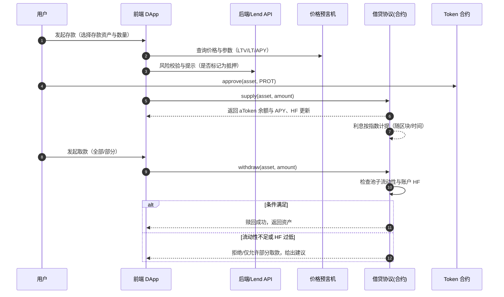
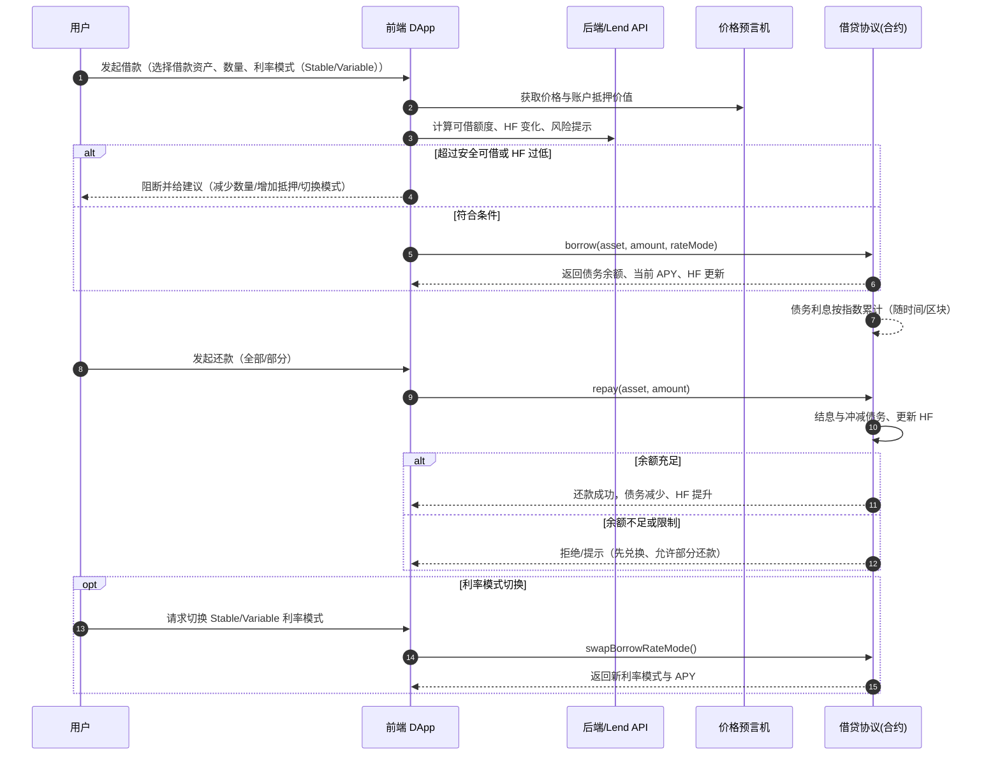
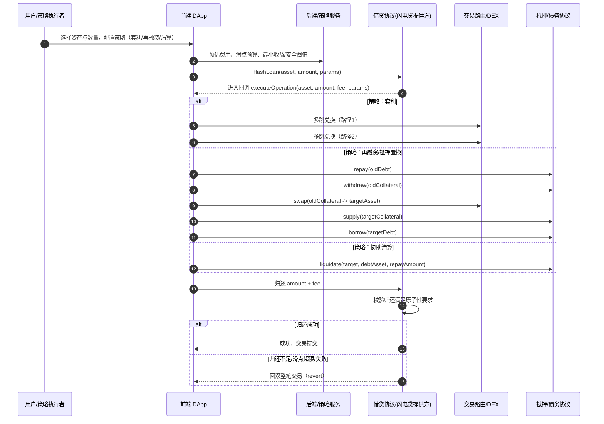
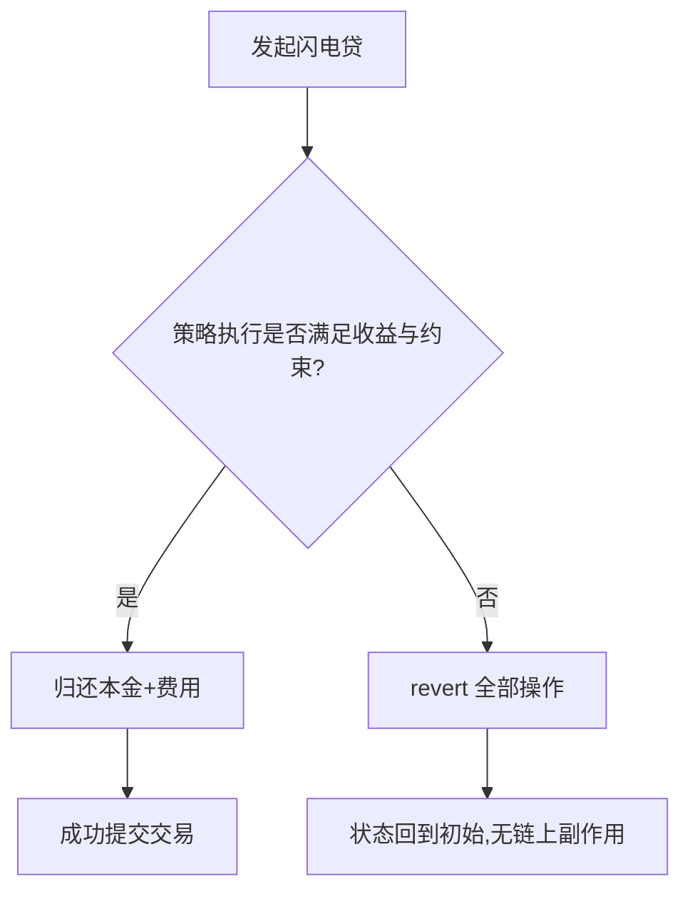
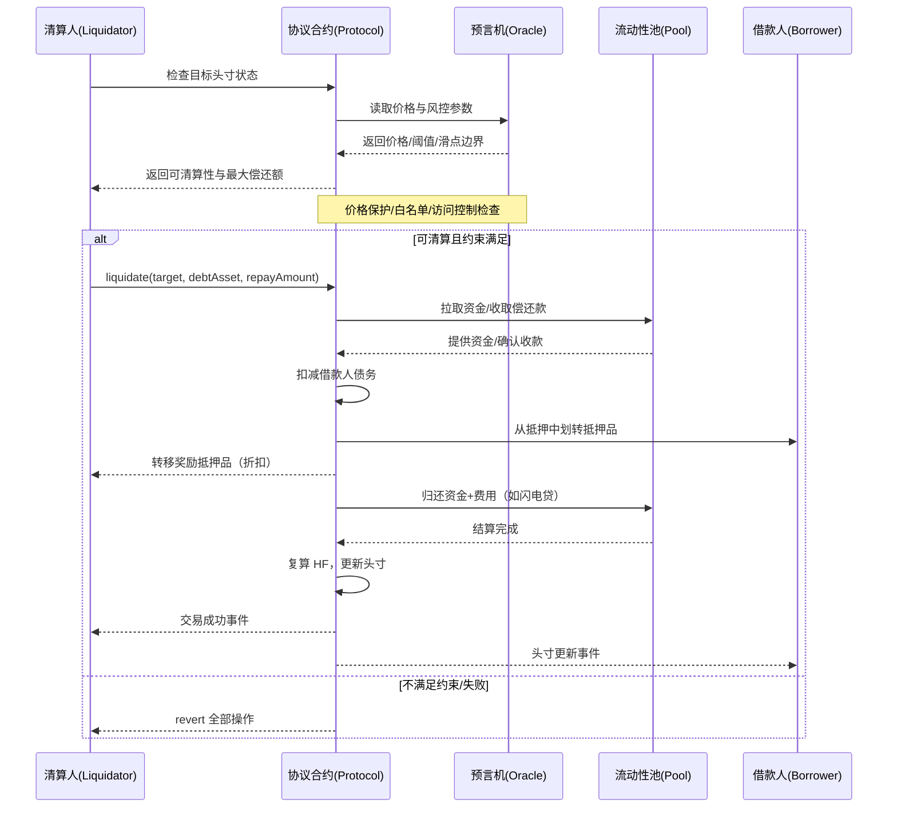

ZippiFi 项目模仿 uniswap，aave，compound 等项目，包括，swap（交易），liquidity（流动性），lend(借贷),stake(质押)，airdrop（空投） ，ai 建议等几大功能。

目前要求对 lend(借贷) 进行详细分析，整理到下面：

---

## 任务范围

- 仅分析 `Lend`（借贷）功能的产品与技术设计。
- 对标 Aave/Compound 的借贷市场模型：支持存款、借款、抵押、利息累积与清算机制。
- 资产范围：明确可抵押资产与可借资产清单，包含 `decimals`、价格源、抵押参数（LTV、LT、清算罚金）。
- 利率模型：覆盖固定/可变利率、基于利用率的利率曲线（线性/分段），以及利息计提与指数（如 `liquidityIndex`）。
- 价格与风控：集成预言机（Chainlink/Pyth）作为价格锚；定义风险参数、触发阈值与清算流程（健康因子计算）。
- 清算流程：部分/全额清算路径、折扣与罚金、清算人激励；异常与边界处理（价格异常、预言机失效）。
- 前端交互：存款/取款、借款/还款、抵押管理、健康因子与风险提示、利率与收益展示。
- 后端与索引：订单与头寸状态索引、利息累计计算、风险预警（健康因子低于阈值）、事件回填与报表。
- 合约接口：与池子/借贷市场合约交互的核心方法（`deposit`、`withdraw`、`borrow`、`repay`、`setCollateral`、`liquidate`）。
- 可观测性：关键事件与失败类型映射、费用与收益统计、异常价格/清算告警与审计日志。
- 范围不含：跨链借贷、闪电贷与高级策略（可在扩展章节单独评估）。

## 页面展示

aave

compound

## Lend(借贷)功能简介：

### 概念

- 借贷市场允许用户将资产存入池子赚取利息（Supply），并以存入资产作为抵押借出其他资产（Borrow）。利息按区块/时间累积，利率可为可变或稳定。头寸以“健康因子（HF）”衡量风险，低于阈值会触发清算。

### 与质押（Stake）的区别

- 目标不同：Stake 侧重锁仓换奖励/通胀分发或网络安全；Lend 侧重资金利用与信贷。
- 风险模型：Stake 通常无借贷与清算风险；Lend 存在价格波动与清算机制（LTV/LT/罚金）。
- 收益来源：Stake 多为协议发放/通胀；Lend 收益来自借款人支付的利息（按利用率动态）。
- 流动性与退出：Stake 常有限定期或解质押规则；Lend 取决于池子可用流动性与风险状态。

### 借贷包含的小功能（模块）

- 存款/取款（Supply/Withdraw）：将资产存入/取出池子，获得/减少利息权。
- 启用/取消抵押（Enable/Disable Collateral）：决定该资产是否计入抵押价值。
- 借款/还款（Borrow/Repay）：按抵押能力借出与归还目标资产。
- 利率模式切换（Stable/Variable）：在稳定利率与可变利率间切换（受限于协议规则）。
- 头寸风险与健康因子：实时显示 HF、预计 HF（操作前后），风险预警与告警。
- 清算视图与模拟：展示清算阈值、罚金与折扣，提供模拟工具与风险提示。
- 奖励与激励（可选）：供应/借款可能有挖矿奖励或积分，分场景展示。
- 历史与报表：存借还取记录、利息计提、奖励累计与导出。
- 风控参数展示：LTV、LT（清算阈值）、清算罚金、储备因子、隔离/冻结状态。
- 价格与预言机：显示价格来源（Chainlink/Pyth），异常喂价与失效提示。

### 页面操作步骤（典型用户流程）

- 第一步：选择资产并存款
  - 查看 `Supply APY/可用流动性/抵押系数`，授权并提交存款交易。
- 第二步：启用抵押
  - 打开抵押开关，确认 `LTV/LT` 与预计健康因子变化。
- 第三步：借款资产
  - 选择要借的资产与金额，查看 `Borrow APY/预计 HF/利率模式`，提交借款交易。
- 第四步：管理头寸
  - 监控 HF 与市场波动，支持补仓（增加抵押）、部分还款、利率模式切换。
- 第五步：还款与取款
  - 归还借款后，按可用流动性与风险状态取回抵押资产；失败时给出可操作建议。
- 异常流程：
  - HF 接近 1 时弹出高风险提示；价格异常或预言机失效时，限制危险操作并提示来源。

### 页面展示（信息架构）

- 市场页（Markets）：
  - 列出资产的 `Supply APY`、`Borrow APY`、`利用率`、`可用流动性`、`抵押系数`、`风险标签（主流/隔离/冻结）`。
- 资产详情页：
  - 历史 APY 与利用率曲线、储备因子、`LTV/LT/罚金`、价格来源与稳定性，入口操作（存款/借款）。
- 个人仓位页（Portfolio）：
  - `供应总额/借款总额/健康因子`、抵押/借款资产列表、收益与成本统计、风险预警卡片与操作快捷入口。
- 借款流程页（Borrow）：
  - 选择资产、输入金额、预估 HF、利率模式（稳定/可变）、限制与费用提示。
- 清算/告警视图：
  - 当前清算风险、潜在清算折扣与罚金、失败类型说明；可并入 Portfolio 的告警卡片。
- 历史与报表：
  - 交易历史、利息计提与奖励记录、CSV/JSON 导出。

### 关键指标速览

- 健康因子（HF）：`HF = (Σ 抵押价值 × LT) / Σ 借款价值`，当 `HF < 1` 时可被清算。
- LTV（贷款价值比）与 LT（清算阈值）：定义可借额度与清算触发边界。
- 利用率（U）：`U = 借款总额 / 供应总额`，影响可变利率与 APY。
- 利息与指数：协议按指数累积方式计提利息，影响余额与收益显示。

## 主要功能说明

### 核心概念速览

- 存款（Supply/Deposit）：将资产存入协议以获得利息与票据资产（如 aToken）。
- 借款（Borrow）：以抵押资产为担保借出目标资产，形成债务余额并按利率计息。
- 抵押（Collateral）：可被用作担保的资产集合，影响可借额度与健康因子。
- 健康因子（HF）：衡量账户安全性的指标，`HF > 1` 通常安全；`HF ≤ 1` 可能被清算。
- 清算（Liquidation）：当账户 HF 低于清算阈值时，清算人偿还部分债务并获得抵押资产折扣。
- 利率模式：稳定利率（Stable）与可变利率（Variable），可按规则切换。
- 利用率（U）：池子层面的拥挤度，影响可变利率曲线与借款 APY。
- 预言机（Oracle）：为风险评估提供价格数据，决定 HF 与可借额度的有效性。

### 关键功能清单

- 存款/取款（Supply / Withdraw）：存入资产赚取利息；符合规则时提取部分或全部资产。
- 借款与还款（Borrow / Repay）：选择利率模式与数量，生成并偿还债务。
- 抵押管理：启用/停用某资产为抵押，调整抵押比例以优化 HF 与可借额度。
- 利率模式切换：在稳定/可变利率间切换（受协议限制与费用约束）。
- 风险与指标视图：实时显示 HF、可借额度、价格影响、池子利用率 U、预估 APY 等。
- 闪电贷与再抵押杠杆（进阶）：以单笔交易临时借入资产实现杠杆或再平衡（需风控）。
- 价格与参数来源：展示预言机价格、LTV、清算阈值、清算奖金、隔离资产/借款上限等。
- 清算入口与规则说明：当账户进入可清算区，支持清算操作与风险提示。

### 1.存款/取款（Supply / Withdraw）

#### 概念说明

- 存款（Supply/Deposit）：将资产存入协议的资金池以赚取利息，同时获得票据资产（如 aToken）用于余额展示与收益计提。
- 取款（Withdraw/Redeem）：赎回已存入的资产，受池子可用流动性、账户健康因子与抵押占用约束。
- 授权与提交：ERC20 资产需先 `approve` 给协议合约，再执行 `supply`；取款无需授权，但可能受抵押与 HF 约束。
- 利息与指数：协议通过指数累计计息，票据资产余额与 APY 随时间增长。
- 抵押开关：将某存入资产标记为“可用作抵押”影响可借额度与 HF；取款时需保证 HF 不跌破阈值。
- 常见约束：
  - 流动性不足：池子可用余额不足时，仅支持部分取款或排队。
  - 抵押占用：取款会降低抵押价值，若导致 HF 过低，会被阻断。
  - 隔离/暂停：隔离资产或治理暂停的市场可能限制取款与供应。

#### 功能时序示意图（Supply/Withdraw）

要点：

- 提交前展示 HF 影响与“可取额度”计算；不足时给出“减少取款”“关闭抵押”“先还款”建议。
- 同步展示利率来源与 APY 构成（基础利率、利用率曲线、协议奖励）。
- 对隔离或暂停市场明确标注限制与治理状态，避免误操作。

### 2.借款与还款（Borrow / Repay）

#### 概念说明

- 借款（Borrow）：以启用为抵押的资产作为担保，按所选利率模式借出目标资产并形成债务余额。
- 还款（Repay）：偿还全部或部分债务，减少利息累计并提升健康因子（HF）。
- 利率模式：
  - 可变利率（Variable）：随池子利用率 U 变化；逼近 kink 后利率陡增。
  - 稳定利率（Stable）：相对平滑但可能较高，受切换/上限/资格规则约束。
- 可借额度：由抵押资产价值与 LTV/清算阈值决定；页面展示“最大可借”“安全可借”。
- 约束与限制：隔离资产、借款上限、市场暂停、利率模式切换费用与资格、抵押开启状态。

#### 功能时序示意图（Borrow/Repay）

要点：

- 借款前展示“最大/安全可借”，并实时计算交易后 HF；超阈值时强制阻断。
- 清晰标注隔离资产、借款上限、暂停状态与模式切换资格/费用。
- 还款支持部分/全部两种；余额不足时引导用户先兑换或使用相同资产偿还。
- 展示 APY 构成与来源（基础利率、利用率曲线、奖励），与价格来源的可信度说明。

### 3.闪电贷

#### 概念说明

- 闪电贷（Flash Loan）：在“同一笔交易”中无抵押借入资产，必须在交易结束前归还本金+费用；未归还则整笔交易回滚（原子性）。
- 典型用途：
  - 套利/价差（跨 DEX 路径套利）。
  - 抵押再融资（偿还旧债 → 提取抵押 → 转换资产 → 重新开仓）。
  - 抵押资产置换（collateral swap）。
  - 协助清算（先借款偿债 → 获得抵押折扣）。
- 关键属性：原子性、费用率、可用流动性与上限、重入保护、滑点与 MEV 风险。

#### 功能时序示意图（Flash Loan）

要点：

- 原子性保障：任何一步失败或利润低于阈值，应主动 `revert`，避免亏损交易上链。
- 预算与阈值：在前端设定“最小可接受收益”“最大滑点”“Gas 预算”，并在回调内严格检查。
- 流动性与费用：受池子可用额度与费用率影响；高拥堵期费用与 MEV 风险上升。
- 安全与合规：使用重入保护、防止价格操纵（TWAP/中位数）、限制可调用目标合约白名单。

#### 回滚逻辑示意

提示：为面试/评审展示时，可在 UI 中同步显示：

- 预计费用与最小收益门槛、可用流动性上限、滑点与路径详情。
- 风险提示（原子回滚、失败常见原因、MEV 与价格波动）。

### 4.清算流程（Liquidation）
#### 概念与目标
- 清算是指当借款人的头寸安全性不足（健康因子低于阈值或抵押率跌破清算阈值）时，允许第三方清算人偿还其部分债务并获得抵押品奖励，以恢复头寸安全并降低协议坏账风险。
- 协议通过风控参数和预言机价格来判断可清算性与清算规模，目标是保护流动性池的健康，避免亏损外溢。

#### 关键参数（常见约定）
- 健康因子 HF：`HF = (抵押品价值 × 清算阈值) / 借款价值`，当 `HF ≤ 1` 时可清算。
- 清算阈值 LT：抵押资产在压力下可计入的价值比例（通常低于初始抵押率 LTV）。
- 部分清算上限：单笔清算可偿还的最大债务比例（如 20%–50%），避免过度惩罚。
- 清算奖励/折扣：清算人以折扣价获取抵押品（如 3%–10%），作为偿还债务的激励。
- 价格来源：采用预言机（如 Chainlink、TWAP、中位数合成）并配合异常保护与暂停策略。

#### 标准清算流程（高层步骤）
1. 监控触发：价格下跌或利息累积导致 `HF ≤ 1`，头寸进入可清算状态。
2. 清算发起：清算人调用 `liquidate(target, debtAsset, repayAmount)` 指定目标与偿还金额（可使用自有资金或闪电贷）。
3. 验证与定价：协议读取预言机价格，计算最大可清算额度、奖励比例与滑点边界，校验交易约束。
4. 偿还债务：清算人偿还部分债务；协议扣减借款人负债并记录应计利息变化。
5. 抵押品转移：协议以折扣价从借款人抵押中划转相应价值的抵押品到清算人地址（含奖励）。
6. 头寸更新：重新计算 HF；若仍不安全，可继续清算直至恢复安全或达到上限。
7. 结算与事件：记录清算事件、更新池子指标，必要时收取协议费用并同步监控告警。

#### 示例计算（简化）
- 抵押品预言机价值：`1000 USDC`；借款价值：`900 USDC`；`LT = 0.8`。
- `HF = 1000 × 0.8 / 900 ≈ 0.888 < 1`，可清算。
- 部分清算上限为 20%，清算人可偿还 `180 USDC` 债务。
- 若清算奖励为 5%，清算人将按折扣价从抵押品中获得对应价值并实现正收益。

#### 风险控制与边界条件
- 原子性保障：价格保护与滑点限制，任一步校验失败则整笔回滚（revert），避免亏损上链。
- 预言机异常：触发暂停或切换到安全模式，禁止清算以防被操纵价格利用。
- 过度清算保护：设置单笔与总量上限，确保借款人不被超额惩罚。
- 访问控制：限制可清算资产白名单与合约调用权限，防重入与闪电贷攻击。

#### 时序图
- 下图展示清算触发、验证定价、偿还债务、转移抵押与头寸更新的整体流程，以及“不满足约束时的原子回滚”分支。

