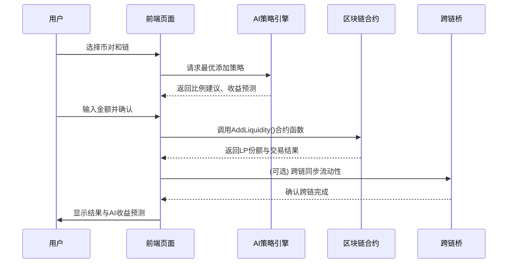
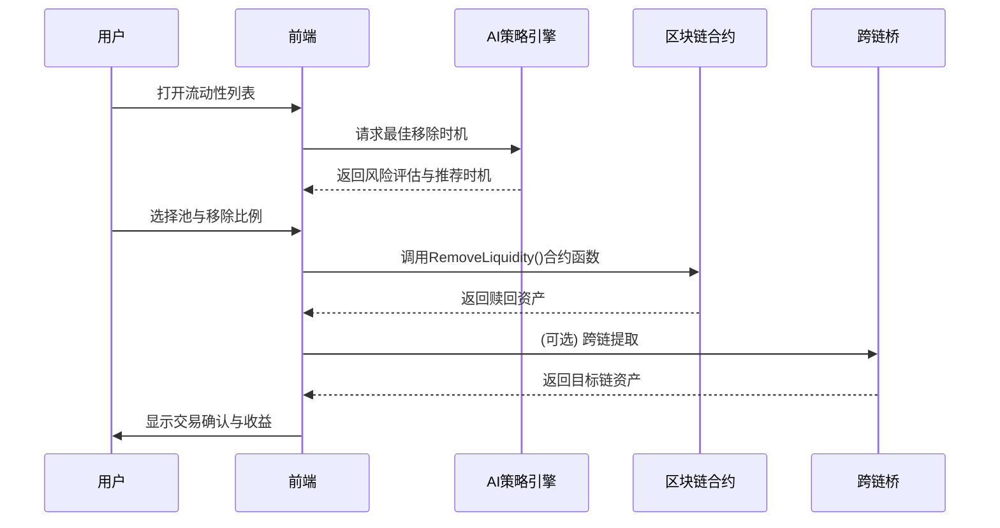
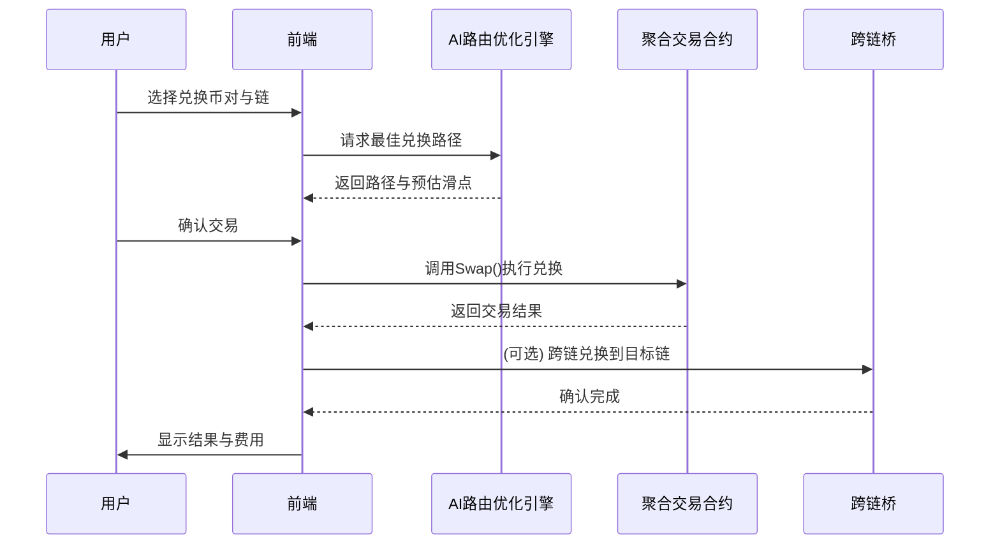
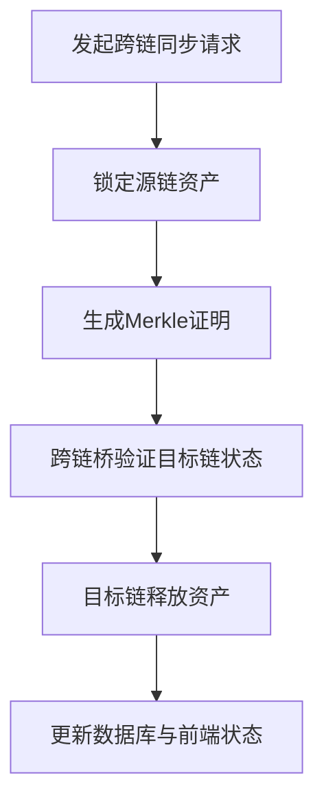
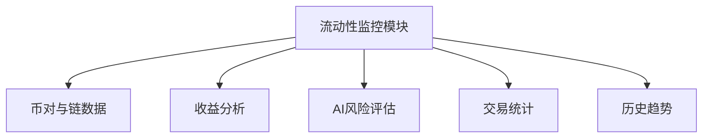

# ZippiFi-liquidity 功能

## 目录

1. [任务范围](https://chatgpt.com/c/690af1a3-daf0-832b-9f4c-d0dfb17c5da0#任务范围)
2. [页面展示](https://chatgpt.com/c/690af1a3-daf0-832b-9f4c-d0dfb17c5da0#页面展示)
3. [功能简介](https://chatgpt.com/c/690af1a3-daf0-832b-9f4c-d0dfb17c5da0#功能简介)
4. [功能说明](https://chatgpt.com/c/690af1a3-daf0-832b-9f4c-d0dfb17c5da0#功能说明)

---

## 任务范围

**目标**
构建一个 AI 驱动的去中心化聚合平台流动性模块，支持：

- 多链互通（跨链流动性同步）
- 多币对管理（多流动性池聚合）
- 智能代币兑换路径优化
- AI 推荐策略（收益/风险/手续费优化）

**核心目标**：

1. 提高流动性聚合效率与深度。
2. 降低用户操作门槛（AI 推荐与预测）。
3. 实现无缝跨链流动性转移与代币兑换。

**系统架构模块：**

- 前端交互层：用户操作与实时数据可视化。
- 智能合约层：执行添加、移除、兑换、桥接逻辑。
- AI 引擎层：策略优化、预测、推荐。
- 跨链桥层：处理链间资产同步。
- 数据分析层：流动性池与收益可视化分析。

---

## 页面展示(pancakeswap)

### 1. 主页面

### 2.创建流动性池

v2:只要你添加了流动性，你都会有收益

v3:你添加的流动性只在某个区间价格有收益

流动性池是否存在依据的是代币合约地址，并非代币名称

### 3.添加流动性页面

当输入一个代币数量，另个一个代币数量会自动计算出来，直接使用，价格波动不大，自己修改，价格波动大

### 3. 移除流动性页面

将自己持有的 LP,兑换成之前的两种代币

### 4. 代币兑换页面

流动性池的流动性越大，改变价格所需的代币数量越多

### 5. 跨链桥接页面

先将源链的代币锁定，然后在目标链上创建等值的包装代币。回链后，包装代币销毁，源链代币解锁。

---

## 功能简介

| 功能        | 概要说明                                           | 可能遇到的问题                       | 核心技术点                                              |
| ----------- | -------------------------------------------------- | ------------------------------------ | ------------------------------------------------------- |
| 添加流动性  | 用户向流动性池提供两种代币资产，获取 LP 代币份额。 | 汇率波动、滑点过高、跨链延迟。       | 智能合约自动配比、AI 比例优化、流动性聚合算法。         |
| 移除流动性  | 用户可赎回部分或全部资产并销毁 LP 代币。           | 流动性池波动、链间延迟、Gas 费用高。 | 多链资产同步、LP 精确销毁、跨链结算机制。               |
| 代币兑换    | 用户可单链或跨链交换代币，AI 优化路径。            | 滑点、路径过长、链间通信不稳定。     | 路由聚合算法、AI 动态路径规划、价格预言机。             |
| 跨链同步    | 流动性或兑换结果可跨链同步，确保多链一致性。       | 链间延迟、桥安全性。                 | 去中心化桥接协议（LayerZero、Axelar）、Merkle 验证。    |
| 多币对支持  | 支持多币对同时提供流动性并聚合。                   | 池子分散、流动性碎片化。             | 动态聚合池管理、自动路由。                              |
| AI 智能推荐 | AI 模块分析收益/风险，推荐最佳策略。               | 模型偏差、数据滞后。                 | 机器学习预测模型（LSTM、Transformer）、实时监控数据流。 |

---

## 功能说明

---

### 1. 添加流动性

初期流动性说明：

1. 平台通过给提供 LP 的用户提供手续费分成、平台代币奖励等方式吸引用户来添加流动性

2. 用户来添加流动性的时候是需要提供两种代币的

3. 第一个用户提供的两种代币数量就是初始价格，基本都会和外部价格一致，不一致可能会造成无偿损失

4. 无偿损失：

   当你在流动性池中存入两种代币（例如 ETH 和 USDC），由于价格波动，
   **你池子中的资产比例发生了变化**，
   如果此时你退出池子、取回代币，它们的总价值**会低于你原本单独持币不动的情况**。

   这个差额，就是“无常损失”。

5. 平台上 ETH 比外部市场便宜，套利者会买进 ETH 并在外部卖出，使池内 ETH 减少 → 价格上升，如果贵了，则卖出 ETH 获取 USDC，使池内 ETH 增加 → 价格下降。

6. 平台不喂价，通过**套利者**自动与外部市场价格对齐

7. 用户添加流动性的动机：1.薅羊毛

8. 用户兑换的动机：1.套利 2 尝鲜 3.稀有币

有关流动性和兑换之间的关系：

​ 1.“流动性”是**兑币发生的基础**

​ 2.“兑币行为”**动态影响流动性池的状态**

**概要说明**
用户选择链和币对，输入数量后，AI 提供最优比例建议与收益预测。交易确认后，调用智能合约完成添加，可选跨链同步。

**关键说明**

- AI 根据历史波动和当前池深度计算最佳配比。
- 跨链桥实现资产同步。
- LP 代币代表用户在流动性池的份额。

**可能问题与解决方案**

- 滑点过高 → 动态调整添加比例。
- 跨链延迟 → 采用异步确认机制。

---

### 2. 移除流动性

**概要说明**
用户可移除部分或全部流动性并获得代币。AI 分析最佳赎回时机与最小滑点。

**关键说明**

- 支持单链或跨链提取资产。
- AI 预测未来收益曲线，辅助用户决策。

**可能问题与解决方案**

- LP 销毁失败 → 增加多签验证机制。
- 目标链延迟 → 使用去中心化中继节点确认。

---

### 3. 代币兑换

**概要说明**
用户选择代币与链后，AI 自动计算最优路径并执行交易，可实现跨链兑换。

**关键说明**

- AI 分析多路径流动性聚合，选择最优路径。
- 聚合合约整合多 DEX 流动性（如 PancakeSwap、Uniswap、SushiSwap）。
- 支持跨链兑换，通过桥接层实现。

**可能问题与解决方案**

- 路径过长导致 Gas 高 → 路由剪枝优化。
- 跨链兑换延迟 → 状态异步确认。

---

### 4. 跨链同步

**概要说明**
跨链桥负责将流动性和兑换状态同步至其他链，确保统一性与安全性。

**关键说明**

- 使用去中心化桥（如 LayerZero / Axelar）保证安全性。
- 通过 Merkle 证明防篡改。
- AI 可分析链上 Gas 状况并推荐低费用时机。

**可能问题与解决方案**

- 源链锁仓失败 → 回滚机制保障资金安全。
- 桥延迟 → 增加链间心跳机制与容错同步。

---

### 5. 流动性监控与分析

**关键说明**

- 实时监控池深度、价格、手续费收益。
- AI 提供收益预测与风险等级标识。

**核心技术点**

- 数据聚合层（TheGraph、Subgraph）
- AI 风控模型（LSTM 预测短期收益波动）
- 可视化框架（D3.js / ECharts）
