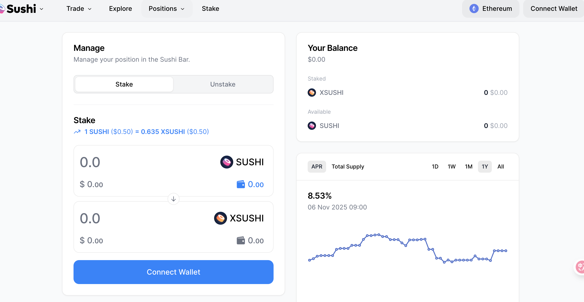
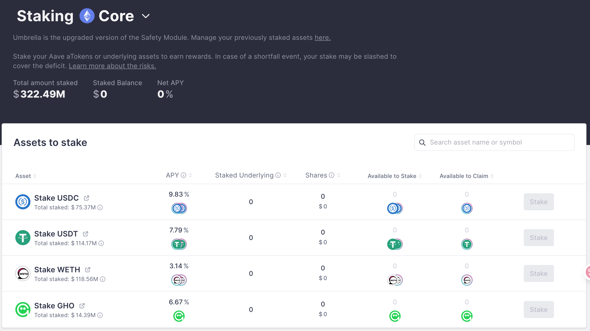
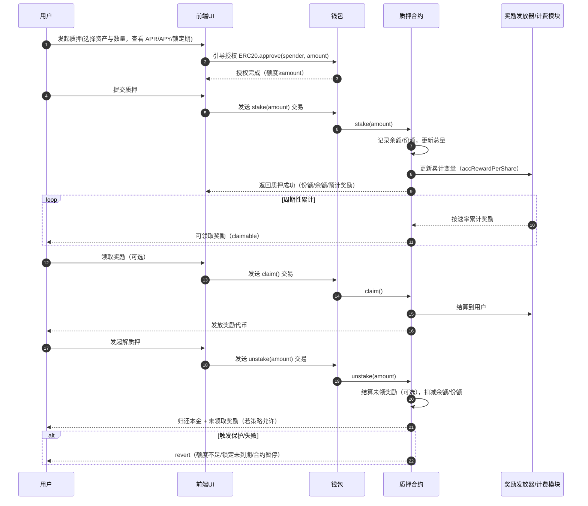
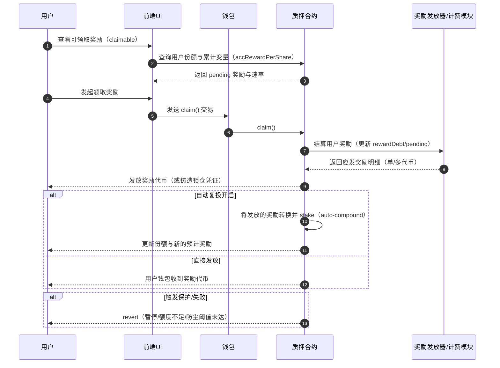

ZippiFi 项目模仿 uniswap，aave，compound 等项目，包括，swap（交易），liquidity（流动性），lend(借贷),stake(质押)，airdrop（空投） ，ai 建议等几大功能。

目前要求对 stake(质押) 进行详细分析，整理到下面：

---

## 任务范围

- 仅分析 `Stake`（质押/解质押与奖励）功能的产品与技术设计。
- 对标 Sushi MasterChef/Aave Staking（Safety Module）等质押与奖励分配模型，支持单币或 LP 质押与线性释放。
- 关注前端交互、钱包授权与链上调用、奖励计算与发放、风控与可观测性；不涉及借贷/交易/治理/跨链等其他模块。

## 页面展示

sushiswap 质押页面

aave 质押页面

### 概念

质押功能目标是构建一个基于去中心化交易协议概念的质押模块，允许用户将特定的加密资产（如 ERC20 代币）质押在合约中，用户将通过质押获得流动性奖励或者平台收益。质押模块的设计目标是保持去中心化、提高安全性、并确保易于用户使用。

- 定义：用户将代币存入并锁定在合约中，按质押金额与时间获得奖励或分成，常用于激励参与、提升协议安全与流动性。
- 资产类型：
  - 单币质押（Single Token）：直接质押平台/奖励代币，领取通胀或收益分成。
  - LP 质押（Liquidity Token）：质押 AMM 的 LP 凭证，叠加做市收益与额外激励。
- 奖励来源：平台代币通胀发放、交易手续费分成、协议收入、外部策略收益等；通常按时间线性累计并按比例分配。
- 奖励模式：线性释放、固定锁定期加成（Boost）、自动复投（提升 APY，需评估成本与风险）。
- 约束参数：最小质押额、锁定/解锁窗口、提前退出罚金、分配权重（allocation points）、奖励精度与结算频率。
- 凭证设计：可选铸造份额凭证（如 sToken）表示用户权益；是否可转让取决于风险策略与治理约束。
- 风险边界：智能合约风险、奖励政策调整、价格波动影响收益；若对接安全模块/验证者需考虑惩罚（slashing）。
- 基本交互：`approve → stake → 周期性累计 → claim 奖励 → unstake`；需在前端清晰展示 APR/APY、锁定期与费用。

### 与借贷的区别

- 目标与产出：
  - 质押：锁定资产换取奖励/分成（APR/APY），不引入负债；更偏激励与安全保障。
  - 借贷：以抵押资产换取可用债务额度，产生利息负债与清算风险；偏资金效率。
- 资产流向：
  - 质押：资产进入奖励/分配合约，领取奖励或凭证（如 sToken）；本金通常不被动变动。
  - 借贷：抵押资产进入借贷池，用户获得债务资产；负债随利息累积变化。
- 收益来源：
  - 质押：协议代币通胀、手续费分成、平台收入或外部策略收益。
  - 借贷：借款人支付利息、清算罚金与费用分配。
- 风险模型：
  - 质押：合约风险、奖励政策与价格波动；若绑定安全模块/验证者存在惩罚（slashing）。
  - 借贷：健康因子（HF）低于阈值触发清算；价格波动与利率变化影响清算与坏账。
- 关键参数：
  - 质押：锁定期、最小质押额、提前退出罚金、分配权重（allocation points）。
  - 借贷：抵押率（LTV）、清算阈值（LT）、清算奖励、利率模型（可变/稳定）。
- 状态变化：
  - 质押：线性累计奖励，用户主动 claim；解质押后释放本金与未领奖励。
  - 借贷：负债与利息持续累积；价格触发时可能部分/全部清算。
- 用户路径与交互：
  - 质押：`approve → stake → 累计/claim → unstake`，通常无外部抵押价值计算。
  - 借贷：`supply → borrow → repay → withdraw`，涉及抵押价值、可借额度与 HF 实时计算。
- 可转让性与凭证：
  - 质押：可能铸造份额凭证（sToken）；是否可转让取决于设计与风险。
  - 借贷：常有 aToken/dToken 等收益/债务凭证；与利率模型与清算机制耦合。
- 可观测性与风控：
  - 质押：关注奖励速率、累计收益、锁定期与退出队列。
  - 借贷：关注池子利用率、利率曲线、清算事件与坏账统计。

### 质押包含的小功能（模块）

- 基础质押/解质押：`stake/unstake`，支持精确数量与最小质押额，返回当前份额与状态。
- 奖励领取（claim）：可随时或按周期领取累计奖励；支持批量领取、指定池领取。
- 自动复投（auto-compound）：将已领取奖励自动加入质押，提高 APY（需考虑费用与滑点）。
- 锁定期与加成（Boost）：7/30/90 天等锁定期提供倍率加成；到期后解锁或续期。
- 多奖励发放器（Rewarder）：同一池支持多种奖励代币，独立速率与权重。
- 多池与权重分配：MasterChef/类似架构，按 allocation points 分配总奖励到各池。
- 奖励排期（Emission Schedule）：线性/阶梯/减半曲线，随时间调整速率与总量上限。
- 罚金与费用：提前退出罚金、绩效费；费用进入运营金库或回购销毁策略。
- 线性释放/锁仓凭证：奖励生成可选择铸造凭证并线性释放（vesting），降低抛压。
- 资产适配：支持单币与 LP 质押；处理 `decimals`、收税代币、黑白名单。
- 安全控制：`ReentrancyGuard`、`Pauseable`、角色权限（Owner/Operator/RewardManager）。
- 事件与索引：`Stake/Unstake/Claim/Harvest` 事件，供前端与索引器统计与展示。
- 前端交互：授权引导、APR/APY 估算器、进度与锁定期提示、失败原因提示与重试。
- 可观测性：奖励速率、累计收益、活跃质押量、退出队列长度、费用与链上失败比率。
- 应急退出（Emergency Withdraw）：在合约异常时允许用户无奖励取回本金，需明确触发条件与权限。

## 主要功能说明

### 质押/解质押

#### 概念

- 质押：用户将代币锁定至合约，按时间与权重线性累计奖励；通常需先执行 `ERC20.approve(spender, amount)` 授权。
- 解质押：满足条件（到期、未暂停、额度充足）后取回本金与未领取奖励；若存在锁定期或提前退出罚金，则按策略结算。
- 计量方式：使用份额（shares）或余额（balance）记录占比；奖励按速率（emission rate）与池权重（allocation points）分配，结算用 `accRewardPerShare` 等累计变量。
- 费用与边界：最小质押额、锁定/解锁窗口、绩效费、提前退出罚金；异常情况下支持应急退出（仅本金、不含奖励）。
- 安全与适配：`ReentrancyGuard`、`Pauseable`、角色权限与白名单；兼容收税代币与不同 `decimals`。

#### 功能时序示意图

### 奖励领取

#### 概念

- 奖励累计：奖励通常按时间与池权重线性累计，使用累计变量（如 `accRewardPerShare`）与用户的 `rewardDebt`/`pending` 进行结算，避免重复发放与精度损失。
- 领取方式：
  - 随时领取（On-demand Claim）：用户主动调用 `claim()` 或在 `stake/unstake` 过程中顺带结算并发放。
  - 周期领取（Scheduled/Batch Claim）：前端或后端在指定周期引导领取，减少链上交互次数与费用。
  - 多奖励领取（Multi-Rewarder）：同一池支持多种奖励代币，按各自速率与权重独立结算与发放。
- 自动复投：可选将领取到的奖励自动加入质押以提升 APY（`auto-compound`），需评估额外交易费与滑点影响。
- 释放与锁仓：奖励可直接发放或铸造锁仓凭证并线性释放（vesting），用于降低抛压与匹配长期激励。
- 边界与保护：最小可领取额度（防尘）、合约暂停（`Pauseable`）、发放失败重试/回退、黑白名单与权限管控。

#### 功能时序示意图

