ZippiFi 项目模仿 uniswap，aave，compound 等项目，包括，swap（交易），liquidity（流动性），lend(借贷),stake(质押)，airdrop（空投） ，ai 建议等几大功能。

目前要求对 swap（交易）进行详细分析，整理到下面：

---

## 任务范围

- 仅分析 `Swap`（代币兑换）功能的产品与技术设计。
- 对标 uniswap/PancakeSwap/BabySwap 的 V2 路由模式，兼容收税代币与多跳路径。
- 关注前端交互、链上调用、风控与可观测性，不涉及其他模块。

## 页面示意图：

uniswap

pancakeswap

## swap（交易）功能简介：

### 概念

- Swap 指在去中心化交易所（DEX）中用一种代币兑换另一种代币。核心目标是以尽可能好的路径与滑点保护，在同链原子结算或跨链多阶段流程中完成兑换。
- 同链为单笔链上原子交易；跨链通常为“源链锁定/桥接 → 目的链兑换”的两段式或异步流程。
- 路由器会在多个池子与多跳路径间优化，兼容收税代币与不同小数位的资产。

### 小功能（模块）

- 同链市价兑换（即时 Swap）：基于当前池子价格执行，支持多跳与最小到手保护。
- 限价单（Limit）：设置目标价，达到后执行；适合等待到价成交。
- TWAP（分批到均价）：将大额兑换拆分为多批，降低价格冲击与滑点。
- 跨链兑换：源链锁定或桥接消息，目的链执行兑换并回传结果与状态。
- 滑点与截止时间：订单保护边界与超时控制，防止极端波动导致超价成交。
- 路径优化与多跳：在多池子间寻找最优路径，兼顾可成交性与价格影响。
- 收税代币支持：使用兼容 fee-on-transfer 的路由方法与最小到手校验。
- 授权与余额检查：自动检测并引导 `approve`，校验余额与额度。
- 失败类型与重试：价格变化/滑点超限/Gas 估算失败等，提供重试与提示。
- 市场数据视图：实时报价图、滑点区间、热门路径与失败统计辅助决策。

### 页面操作步骤（同链）

- 第一步：选择代币与链、输入兑换数量
  - 校验代币 `decimals/余额/授权`，提示最小单位与小数精度。
- 第二步：获取报价与路径
  - 展示 `预估到手/价格影响/滑点`，可打开“详细路径与池子流动性”。
- 第三步：设置保护与选项
  - 滑点与截止时间（如 0.5%/10 分钟）；可选择私有 RPC 或 MEV 保护选项。
- 第四步：授权与提交交易
  - 若未授权则先 `approve`，随后提交路由交易；展示 Gas 预估与费用。
- 第五步：确认与结果回填
  - 等待区块确认，显示成交明细、到手数量差异、失败原因与重试建议。

### 页面操作步骤（跨链）

- 第一步：选择源链与目的链、代币与数量
- 第二步：获取跨链报价与费用
  - 展示桥接费、目的链 Gas 预算、双滑点与双截止时间设置。
- 第三步：源链侧执行
  - 发起源链锁定/桥接交易，提示事件监听与预计时延。
- 第四步：目的链侧执行
  - 后端/桥消息触发目的链兑换；用户查看状态进度与风险提示。
- 第五步：完成与回传
  - 展示目的链到手数量与费用明细，失败时提供退款/重试流程说明。

### 页面展示（信息架构）

- Swap 主页面：
  - 代币选择器、金额输入、当前汇率与滑点保护、路径与价格影响、Gas 与费用提示。
- 路径详情与池子流动性：
  - 多跳路径、各池子深度与费率、预计到手分解与风险标签（小流动性/收税代币）。
- 高级选项：
  - 滑点与截止时间、私有 RPC/MEV 保护、最小到手校验开关、收税代币兼容提醒。
- 结果与历史：
  - 成交结果、失败类型归因与提示、交易历史与导出；跨链显示桥接进度与状态机。
- 市场数据页（联动）：
  - 实时报价图、OHLCV、TWAP/均线叠加、热门路径与失败统计，用于决策与风控。

### 关键参数与提示

- 滑点：兑换价格保护的百分比边界；过小可能成交失败，过大可能价格恶化。
- 截止时间：订单超时时间；超时后需重报报价或重新提交。
- 价格影响：路径对池子价格的冲击程度；建议在低流动性时采用小额或 TWAP。
- Gas 与费用：包含链上 Gas、跨链桥费（跨链时）；透明展示总成本。
- 授权与额度：`approve` 额度建议使用精确或最小必要，避免无限授权风险。
- 风险提示：收税代币、预言机异常（若显示参考价）、跨链时延与失败回滚策略。

## 功能说明

SWAP 功能包括以下几个功能：

### 1.swap（币币兑换，包括同链交换与跨链兑换）

- 概念：在同一链内或跨链进行代币兑换；同链为原子结算，跨链为多阶段且包含桥接与目的链执行。
- 流程：选择代币与金额 → 获取报价与路径 → 授权/模拟 → 下单并以最小到手保护（滑点）。
- 特殊：收税代币需使用支持费的路由方法；跨链需考虑桥费用、消息验证与目的链 gas 提示。

#### 同链 vs 跨链 Swap 概览时序图

ASCII 概览：

`U → FE → BE → WL → (同链: RT → PO) | (跨链: 源链RT/桥 → DRT → DPO) → U`

图中要点：

- 双滑点/双截止时间：同链一次校验；跨链需源链与目的链分别设置与校验。
- 费用提示：跨链需桥费与目的链 Gas 预算；同链仅链内 Gas。
- 状态与回滚：监听事件与桥消息，失败时提供重试/退款策略与清晰提示。

### 2.limit（限价单，到价成交）

- 概念：仅当目标价格达到或更优时才执行兑换，提供价格保护与被动成交能力。
- 方式：后端监控到价触发或协议级限价订单（可取消与到期）；到价时再执行链上 swap。
- 关键：触发价、最小到手、滑点与到期时间；采用预言机/多源报价防尖刺与误触发。

#### 限价单功能时序示意图

ASCII 概览：

`U → FE → BE ↔ PX → WL → RT → PO → U`

要点提醒：

- 触发条件：支持“价格 ≥/≤ 目标价”，可选择使用 TWAP/中位价以降低噪声。
- 滑点与截止：到价后仍需滑点保护；订单具有过期时间与重试策略。
- 部分成交：默认全额成交，若需分批成交请结合 TWAP/分批逻辑。
- 数据来源：以链上池子价格为主，预言机/聚合价仅作锚定与异常告警。
- 失败回滚：成交失败时提示原因（价格变化/滑点超限/Gas 不足），支持重试或取消。

### 3.TWAP（时间加权平均价格，拆分多笔，）

- 概念：在一段时间内将大单拆分为多笔执行，使成交均价更接近期间平均价格，降低单次冲击与滑点。
- 参数：批次数/间隔、单批滑点与价格影响阈值、执行窗口与重试策略；可用私有 RPC 降低 MEV 风险。
- 场景：大额兑换、低流动性池、做市与风控策略；可配合到价条件组合使用。

#### TWAP 功能时序示意图

ASCII 概览：

`U → FE → BE ↔ PX → WL → RT → PO → FE`

要点提醒：

- 策略选择：均分批次或自适应（按实时深度调整单批数量）。
- 噪声抑制：用中位价/TWAP/价格带判断是否执行，避免尖峰影响。
- 风控阈值：单批最大价格影响、连续失败上限、总窗口截止时间。
- 费用与 MEV：建议支持私有 RPC 或保护标志，展示累计 Gas 与桥费（跨链时）。

### 4.加密货币与法币兑换

- 概念：通过法币通道（on-ramp/off-ramp）在链下完成加密货币与法币的兑换。
- 方式：集成第三方服务（如 Transak/Ramp/Mercuryo），涉及合规/KYC/反洗钱与支付结算。
- 区分：不同于链上 swap；通常走外部支付与托管流程，费用与时延、失败处理都与链上交易不同。

#### 加密货币与法币兑换功能时序示意图

ASCII 概览：

`U → FE → PSP/KYC ↔ BE → (On-ramp: OTC → WL) | (Off-ramp: WL → PSP/OTC → 银行) → U`

要点提醒：

- 合规与限额：不同地区的 KYC/AML 要求与单笔/日累计限额需明确提示。
- 报价与锁定：法币 ↔ 加密货币汇率有锁定窗口与滑点条款，超时需重报。
- 费用组成：支付手续费、兑付/清算费、链上 Gas；分场景透明展示。
- 时延与风险：法币侧结算通常 T+0/T+1；链上需确认数；失败要清晰归因。
- 退款/申诉：支付失败或 KYC 拒绝时的退款路径与时效说明。

### 5.市场数据视图

- 概念：展示价格随时间的变化与关键交易指标，帮助用户决策与风控。
- 内容：当前报价、滑点/价格影响、路径分解、池子流动性与事件状态；可叠加热门路径与失败类型统计。
- 作用：提高可观测性与透明度，支持提示与错误映射，优化用户体验。
- 概念扩展：

  - 数据分层：即时报价（Tick/Depth）、K 线/OHLC（1m/5m/1h/1d）、链上池子状态（储备/费率/TVL/交易量）、事件与告警（暂停、池子迁移、路由变更）。
  - 指标体系：价格影响/滑点、最优路径对比、流动性占比、交易失败类型分布、MEV 风险提示、预估 Gas 与成功率。
  - 一致性与延迟：不同数据源存在更新延迟与采样差异，需在 UI 明示时间戳与来源，避免决策偏差。

- 可用数据源（示例）：

  - 链上直读：`RPC/Provider`（Infura/Alchemy/自建节点）读取池子储备、费率、tick、事件日志。
  - 子图索引：`The Graph`（Uniswap/Sushi/Curve 官方或社区子图）获取历史交易量、TVL、K 线聚合等。
  - 聚合器 API：`1inch`、`0x`、`OpenOcean` 路由与报价；用于路径与价格影响对比。
  - CEX/行情：`TradingView` 图表组件或 `Lightweight Charts` + 第三方行情源（如 `CoinGecko/CoinMarketCap`）；用于可视化与参考价格。
  - 自建数据后端：Kafka/ClickHouse/TimescaleDB 存储与聚合，提供统一查询与缓存（BFF/GraphQL）。
  - 监控与告警：Prometheus/Grafana 订阅合约事件与 API 健康，生成暂停/异常提示。

- 集成建议：

  - 数据代理层（BFF）：统一封装来源、降采样与缓存策略，向前端暴露一致的字段与时间戳。
  - 容错与回退：主源失败时切换备源；显示“数据延迟/来源切换”提示，避免误导。
  - 合规与版权：明确数据来源与使用条款（TradingView/CoinGecko 等），遵守速率限制与品牌规范。
  - 可观测性：记录查询耗时、错误率与来源占比，用于优化体验与成本。

以下示意图展示市场数据视图的数据流与回退逻辑：

```mermaid
flowchart LR
  UI[前端: 市场数据视图] --> BFF[BFF/数据代理层]
  BFF -->|报价/路径| AGG[聚合器 API:1inch/0x...]
  BFF -->|池子状态/事件| RPC[链上节点 RPC]
  BFF -->|历史/统计| SUB[The Graph 子图]
  BFF -->|行情/K线| TV[TradingView/行情源]
  BFF --> CACHE[(缓存/时序库)]

  subgraph Providers
    AGG
    RPC
    SUB
    TV
  end

  AGG --> BFF
  RPC --> BFF
  SUB --> BFF
  TV --> BFF
  CACHE --> BFF

  BFF --> UI

  %% 回退与告警
  BFF -->|主源失败| Fallback[切换备源/降级展示]
  Fallback --> UI
```

- 字段与展示建议：
  - 价格/时间戳/来源：`price`, `ts`, `source`；在图表上显示数据延迟与来源徽标。
  - 滑点与路径：`priceImpact`, `route`, `liquidityShare`；支持展开路径明细与费用构成。
  - K 线与指标：`open/high/low/close/volume`；可叠加 `EMA/SMA/Bollinger` 与交易量柱。
  - 告警与状态：池子暂停/迁移、异常波动、API 限流；在 UI 显示醒目提示与回退状态。

## 按接口区分：操作类接口和查询类接口

为保证前端/后端与链上/第三方服务的协同一致，Swap 接口划分为“操作类（交易/签名）”与“查询类（只读/行情/路由）”。下面给出典型接口清单与作用说明，便于实现与联调。

### 操作类接口（交易/签名）

- 钱包与签名：
  - `eth_requestAccounts` / `wallet_switchEthereumChain`：连接钱包与网络切换。
  - `personal_sign` / `eth_signTypedData_v4`：用于离线授权或链下签名（如某些聚合器需要）。
- 授权与额度：
  - `ERC20.approve(spender, amount)`：标准授权，供路由合约消费代币。
  - `Permit2.permit(address owner, address token, amount, deadline, signature)`：无须先发 approve 的授权方式，提升 UX。
- 代币包装与解包：
  - `WETH.deposit()` 与 `WETH.withdraw(amount)`：原生 ETH 与 WETH 转换。
- 路由与交换（示例按常见 DEX）：
  - Uniswap v2：`Router.swapExactTokensForTokens`, `swapTokensForExactTokens`, `swapExactETHForTokens`, `swapExactTokensForETH`。
  - Uniswap v3：`Router.exactInputSingle`, `exactInput`, `exactOutput`, `multicall`, `unwrapWETH9`。
  - 聚合器：`1inch Router` / `0x Exchange Proxy` 的 `swap`/`transformERC20` 等交易端点（通过 API 返回 calldata + `to` 地址，前端直接 `eth_sendTransaction`）。
- 跨链（如启用）：
  - 桥合约：`Bridge.lock/mint/burn/redeem` 等；或跨链聚合器（Socket/LI.FI）提供的 `callData` 执行交易。
- 交易提交：
  - `eth_estimateGas`, `eth_sendTransaction`：前端估算 Gas 与提交；后端可选提供代付或预执行检查。

### 查询类接口（只读/行情/路由/监控）

- 链上只读：
  - Uniswap v2：`Pair.getReserves`, `Factory.getPair`；读取储备与池子地址。
  - Uniswap v3：`Pool.slot0`, `liquidity`, `ticks`；读取价格刻度与流动性。
  - 价格/路由预估：`QuoterV2.quoteExactInputSingle`, `quoteExactInput`, `quoteExactOutput`。
  - 账户状态：`ERC20.balanceOf`, `ERC20.allowance`；前端校验余额与授权。
- 路由与报价 API：
  - `1inch / 0x / OpenOcean` Quote：输入 `sellToken/buyToken/amount/address` 返回最优路径、价格影响与 calldata（仅查询不执行）。
  - `Paraswap`：价格与路径对比，用于聚合策略参考。
- 行情与图表：
  - `TradingView` Widget / `Lightweight Charts`：前端图表组件；数据源可接 `CoinGecko/CoinMarketCap` 或自建后端。
  - K 线与统计：`The Graph`（Uniswap/Sushi 官方或社区子图）拉取 TVL、交易量、历史价格聚合。
- 风险与监控：
  - 事件订阅：路由/池子事件（暂停、迁移、费率调整）；用于 UI 告警。
  - MEV 与失败分布：后端统计失败类型与价格偏差，前端展示提示。
- 可观测性：
  - 健康检查与限流信息：后端或第三方 API 的状态页，前端在数据视图显示来源与延迟。

### 字段与约定（建议）

- 操作请求（示例）：
  - `SwapRequest`：`sellToken`, `buyToken`, `amountIn`, `slippage`, `deadline`, `route`, `permitSig?`, `chainId`。
  - 返回：`to`, `data`, `value`, `gas`, `quote`, `priceImpact`, `sources`。
- 查询响应（示例）：
  - `MarketQuote`：`price`, `ts`, `source`, `route`, `liquidityShare`, `estimatedGas`, `successRate`。
  - `PoolState`：`reserve0/1` 或 `slot0/liquidity/tick`, `fee`, `paused?`。

### 集成与容错

- 主源/备源：为报价与路由配置主源与备源，失败时回退并在 UI 标注“来源切换/数据延迟”。
- 一致性：所有接口返回需包含 `ts` 与 `source` 字段，便于用户理解数据新鲜度。
- 合规与版权：明确第三方 API/图表组件使用条款与品牌规范，遵守速率限制。
